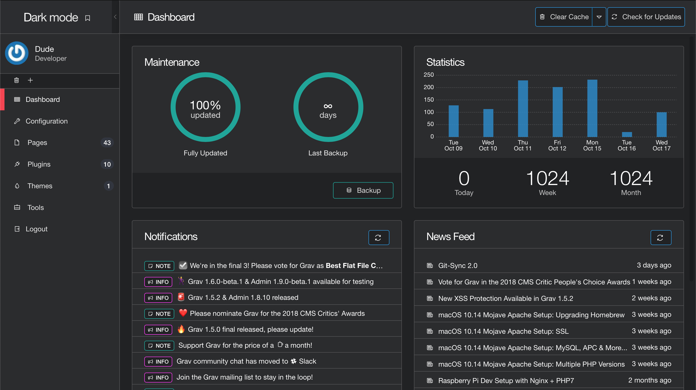

# Grav Darkadmin Plugin

I modified Romain Fallets **customadmin plugin**.  
[Check it out here](https://github.com/RomainFallet/grav-plugin-customadmin)

Of course, this plugin has the same requirements as Romains:
- Grav 1.0.10 or later
- Grav Admin Plugin 1.0.9 or later

# Installation

Install this plugin the same way you install all plugins.  
Copy the content of this repository into `user/plugins` and you're good to go.
